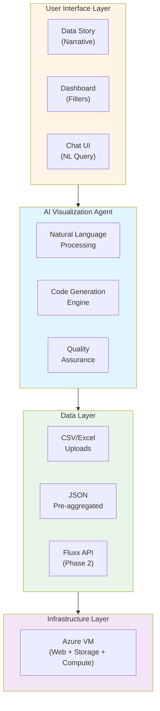

# Technical Proposal: Geographical Data Visualization Dashboard for Tata Trusts

**Submitted by:** [Bidder Name]
**Date:** November 2025
**RFP Reference:** Design & Development of Geographical Data Visualisation Dashboard

---

## Executive Summary

We propose an innovative **AI-Powered Data Visualization Platform** that fundamentally transforms how Tata Trusts creates, consumes, and acts on data insights. Unlike traditional dashboard solutions that require weeks of development for each new visualization, our approach leverages **AI agents** (powered by GPT-5 Codex or Claude 4.5 Sonnet) to generate any data visualization on-demand based on natural language requests.

**Key Value Propositions:**

- **Infinite Flexibility**: Create any chart, any time, without waiting for development cycles
- **Natural Language Interface**: "Show me efficiency by state" → instant visualization
- **Rapid Iteration**: Refine visualizations through conversation, not change requests
- **Cost Efficiency**: Eliminates ongoing development costs for new reports
- **Future-Proof**: Adapts to evolving requirements without re-architecture

View the [demonstration data story](../dataviz/index.html) and [interactive dashboard](../dataviz/dashboard.html) showcasing 16 production-ready visualizations created using this methodology, featuring portfolio overview, efficiency analysis, geographic targeting, and operational insights across multiple chart types.

---

## 1. Understanding of Requirements

### 1.1 Context and Challenge

Tata Trusts operates across diverse thematic areas (health, education, livelihoods, water, sanitation, community development) with:

- **~500 active grants** spanning multiple geographies
- **100M+ beneficiary records** requiring analysis
- **Multiple stakeholder groups** (leadership, analytics team, program heads) with varying information needs
- **Dynamic requirements** that evolve as programs mature

The challenge is not just building a dashboard—it's creating a **decision support ecosystem** that adapts to changing questions without becoming a development bottleneck.

### 1.2 Phase 1 Scope (Pre-Bid Clarifications)

Based on the RFP and pre-bid meeting on November 11, 2025:

**Target Audience**: Trust leadership and internal analytics teams
**Access**: Internal only (Google OAuth 2 authentication)
**Data Volume**: 500 grants, up to 100M beneficiary records, 4-5 years historical
**Data Sources**: Excel/CSV uploads initially, API integration (Fluxx, DMP) in Phase 2
**Timeline**: 2 months from contract award
**Deliverables**: Requirements spec, wireframes/prototype, functional GIS dashboard, training, documentation
**Technology Preference**: Open to open-source and proprietary solutions; Trusts have Microsoft 365 and Power BI licenses but seek alternatives
**Communication**: Daily/bi-weekly stand-ups via Microsoft Teams

**Deferred to Phase 2**:

- Role-based access control (beyond basic OAuth)
- External data integration (Census, NFHS, NITI Aayog, etc.)
- AI-enabled insights (though Phase 1 proof-of-concept welcomed)
- Automated scheduled reporting
- Advanced features (time-series animation, predictive modeling)

---

## 2. Proposed Solution: AI-Agent Architecture

### 2.1 Core Innovation

Our solution centers on **conversational data visualization** powered by AI agents that:

1. **Understand Intent**: Parse natural language requests like "Show efficiency scatter by partner capacity"
2. **Select Approach**: Choose appropriate chart type, aggregations, and visual encoding
3. **Generate Code**: Create production-quality visualizations using Observable Plot, D3.js, or similar
4. **Iterate Rapidly**: Refine based on feedback without manual coding

**Example Workflow:**

```
User: "How timely are our disbursements?"
Agent: [Analyzes grant_tranches.csv]
      [Selects bar chart showing delay_days distribution]
      [Generates disbursement-timeliness.js module]
      [Renders chart with caption: "72% of tranches disbursed within 14 days"]

User: "Break it down by theme"
Agent: [Modifies to faceted bar chart by theme]
      [Updates chart in ~10 seconds]
```

### 2.2 Architecture Diagram



### 2.3 Technology Stack

**Frontend:**

- **HTML5/CSS3/JavaScript ES2022+**: Modern web standards, no build complexity
- **Bootstrap 5.3**: Responsive layout, consistent UI components
- **Observable Plot**: Declarative, accessible chart specification
- **D3.js v7**: Advanced visualizations, geospatial projections
- **Lit-html**: Efficient DOM updates for dynamic filtering

**AI Agent:**

- **GPT-5 Codex / Claude 4.5 Sonnet**: Latest models for code generation and reasoning
- **Custom Prompts**: Tuned for Observable Plot, Tata Trusts style guide
- **Process Documentation**: See [development process documentation](../process/)

**Data Layer:**

- **CSV Import Pipeline**: JavaScript-based CSV parsing and validation
- **JSON Pre-aggregation**: Pre-computed aggregates stored as JSON files for fast loading
- **File-based Storage**: Simple directory structure on VM for data files

**Hosting (Phase 1):**

- **Cloud Provider**: Microsoft Azure (aligns with M365 infrastructure)
- **Compute**: Azure VM (Standard B2s or equivalent - 2 vCPUs, 4 GB RAM)
- **Storage**: VM disk storage for application files, CSV uploads, and JSON caches
- **Authentication**: Google OAuth 2.0 for user login
- **Estimated Cost**: ~₹8,000-12,000/month (VM + bandwidth)

**GIS Capabilities:**

- **Mapbox GL JS**: Interactive maps with custom styling
- **Leaflet**: Fallback for simpler map requirements
- **TopoJSON/GeoJSON**: India administrative boundaries (state/district/block/GP)
- **NITI Aayog Shapefiles**: Aspirational districts/blocks polygons

### 2.4 Why AI Agents vs Traditional Dashboards

| Aspect                   | Traditional Dashboard               | AI-Agent Approach                         |
| ------------------------ | ----------------------------------- | ----------------------------------------- |
| **New Chart Request**    | 2-5 days (dev cycle)                | 2-5 minutes (conversation)                |
| **Custom Analysis**      | Change request → backlog            | Immediate, conversational refinement      |
| **Technical Dependency** | Developers required for all changes | Business users self-serve simple queries  |
| **Cost Model**           | Ongoing dev costs for every change  | One-time setup, minimal maintenance       |
| **Adaptability**         | Hard-coded logic, brittle           | Adapts to new data columns, relationships |
| **Learning Curve**       | Dashboard-specific training         | Natural language, intuitive               |
| **Scalability**          | Linear (add charts = add dev time)  | Exponential (agent learns from examples)  |

**Real-World Example from Submission:**

The 16 charts in the [demonstration](../dataviz/index.html) were created in **~6 hours of AI-assisted development**, whereas traditional development would require **4-6 weeks** for the same scope (wireframes, coding, testing, revision cycles).

---

## 3. Functional Requirements Compliance

### 3.1 Core GIS Dashboard (Must Have)

**Requirement**: Interactive map-based dashboard displaying projects/grants at country, state, district, block, village levels.

**Solution**:

- **Base Layer**: Mapbox GL JS rendering India administrative boundaries
- **Data Points**: Grant locations plotted as circles (size = budget, color = theme)
- **Interactive Controls**: Pan, zoom, click for details
- **Drill-Down**: Click state → filter to districts → blocks → villages
- **Overlays**: Thematic layers (poverty, health, education indicators)

**Demo**: See coverage map examples in [interactive dashboard](../dataviz/dashboard.html)

### 3.2 Multi-Layer Visualization (Must Have)

**Requirement**: Heat maps, cluster maps, thematic coloring for intensity-based insights.

**Solution**:

- **Heat Maps**: Beneficiary density, funding concentration
- **Cluster Maps**: Automatically group nearby projects (Mapbox supercluster)
- **Choropleth**: Color districts by deprivation index, coverage per 1k, funding per capita
- **Bubble Maps**: Circle size = beneficiaries, color = outcome index

**Chart Types Demonstrated** (see [dashboard](../dataviz/dashboard.html)):

- Scatter plots (efficiency quadrants)
- Bar charts (partner performance, state fairness)
- Line charts (time-series, coverage vs need)
- Waterfall charts (KPI decomposition)
- Box plots (capacity variance)
- Heatmaps (partner traffic-light matrix)
- Faceted panels (monsoon effect across themes)

### 3.3 Data Integration (Must Have)

**Phase 1 Approach:**

1. **CSV/Excel Upload Interface**:
   - Web form for file upload
   - Validation: column mapping, data types, mandatory fields
   - Preview before commit
   - Error reporting (missing districts, invalid dates)

2. **Backend Pipeline**:

   ```javascript
   // JavaScript CSV processing
   async function processUpload(file) {
     const rows = await parseCSV(file);
     validateSchema(rows);  // Check required columns
     geocodeLocations(rows); // Match district names to GeoJSON
     saveToJSON(rows);  // Store as JSON files
     invalidateCaches();  // Refresh dashboard data
   }
   ```

3. **Data Storage**:
   - `data/grants.json`: Master grant data
   - `data/beneficiaries.json`: Outcome tracking
   - `data/geo_coverage.json`: District-level need/coverage
   - `data/monitoring.json`: Operational metrics
   - `data/tranches.json`: Disbursement log
   - `data/aggregates/*.json`: Pre-computed summaries for fast loading

**Phase 2 Extensions** (rate-carded):

- **Fluxx REST API**: OAuth authentication, periodic sync (daily/weekly)
- **DMP Integration**: Snowflake connector for KPI warehouse
- **External APIs**: Census, NFHS (via government data portals)

### 3.4 Analytics & Reporting (Must Have)

**Example Analyses** (demonstrated in [data story](../dataviz/index.html) and [dashboard](../dataviz/dashboard.html)):

1. **Portfolio Overview**: Budget, reach, outcomes small multiples
2. **Efficiency Scatter**: Outcomes per ₹ vs beneficiaries per ₹ quadrant analysis
3. **Geographic Targeting**: Coverage vs deprivation by district
4. **Underserved Pockets**: Ranked list of high-need, low-coverage districts
5. **KPI Waterfall**: Decomposition of composite outcome index
6. **Coverage-Need Gaps**: Line chart showing decile mismatches
7. **Diminishing Returns**: Scatter with trend showing budget efficiency curve
8. **Timeliness Impact**: How delay affects outcomes (bar chart with CI)
9. **Partner Performance**: Traffic-light heatmap (efficiency × impact × risk)
10. **Funds-NPS-Dropout**: Dual scatter identifying "sweet spots"
11. **Urban Anomalies**: Flag unusual urban/rural spend ratios
12. **State Fairness**: Per-capita funding by state with delta labels
13. **Women & Dropout**: Binned scatter showing correlation
14. **Monsoon Effect**: Faceted bars comparing pre/post-monsoon outreach
15. **Capacity Variance**: Box plots showing capacity reduces outcome variance
16. **Coverage Impact**: Cumulative curve showing high-need coverage ROI

These serve as **examples** of what the AI agent can generate. The platform is not limited to these charts—any analysis can be requested in natural language and generated on-demand.

**Filters** (implemented in dashboard):

- Theme (Health, Education, Livelihoods, Water, etc.)
- State (multi-select dropdown)
- Need Decile (1-10)
- Date Range (future enhancement)
- Partner Capacity (High/Medium/Low)

**Export Formats**: PDF, PNG, Excel (CSV), SVG

### 3.5 Secure Platform with Role-Based Access (Phase 2)

**Phase 1**: Google OAuth 2.0 authentication (email-based access control)
**Phase 2**:

- Fine-grained roles: Admin, Analyst, Viewer, Trustee
- Permissions: Data upload, chart creation, export, user management
- Audit logging: Track who viewed/exported what data

### 3.6 Scalability & Performance (Good to Have)

**Current Approach:**

- **JSON Pre-aggregation**: Pre-compute common aggregates and store as JSON files
- **Client-side Caching**: Browser caches aggregated data to reduce server load
- **Lazy Loading**: Charts render only when scrolled into view
- **Progressive Enhancement**: Show placeholder → spinner → chart
- **Responsive Design**: Works on mobile (tested iOS Safari 14+, Chrome Mobile 90+)

**Load Testing**: Target 50 concurrent users, <2s page load, <500ms chart render

---

## 4. Approach & Methodology

### 4.1 Development Methodology: Agile with AI Acceleration

**Sprint Structure** (2-week sprints):

- Sprint 0 (Week 1-2): Requirements, data model, infrastructure setup
- Sprint 1 (Week 3-4): Core dashboard, 5 priority charts
- Sprint 2 (Week 5-6): Remaining charts, AI agent tuning, UAT
- Sprint 3 (Week 7-8): Feedback iteration, documentation, training

**Daily Workflow:**

1. **Morning Stand-Up** (15 min): Progress, blockers, plan for day
2. **AI-Assisted Development** (4-6 hours): Pair programming with GPT-5 Codex/Claude 4.5 Sonnet
3. **Visual Validation** (1 hour): Screenshot comparison, accessibility checks
4. **Client Review** (30 min): Demo new charts, gather feedback
5. **Evening Commit**: Push to GitHub, update status

**AI Agent Process** (see [detailed process documentation](../process/)):

1. **Prompt Engineering**: Provide context (RFP, data schema, style guide, sample chart)
2. **Iterative Generation**: "Create efficiency scatter" → review → "Make circles larger" → review
3. **Visual Feedback Loop**: Take screenshots, let agent self-critique and improve
4. **Documentation**: Agent generates templates for future charts

### 4.2 Phase 1 Timeline (8 Weeks)

**Week 1-2: Foundation**

- Requirements workshop (1 day, in-person/Teams)
- Finalize data schema and CSV formats
- Set up Azure VM infrastructure
- Design wireframes for dashboard layout (provide 1 sample as per RFP)
- Establish brand guidelines compliance (colors, fonts, logos)
- **Deliverable**: Requirements specification document, wireframe, access to staging environment

**Week 3-4: Core Development**

- Implement CSV upload pipeline
- Create data loading utilities and JSON aggregation scripts
- Develop 5 priority charts (per client ranking):
  1. Portfolio overview map
  2. Efficiency scatter
  3. Geographic targeting
  4. Financial insights (commitment vs disbursed)
  5. KPI waterfall
- Build dashboard shell (navbar, sidebar, filters)
- **Deliverable**: Working dashboard with 5 charts, demo session

**Week 5-6: Expansion**

- Add 11 additional charts (see section 3.4)
- Implement filters (theme, state, need decile)
- Create data story (scrollytelling narrative)
- Add export functionality (PNG, PDF, CSV)
- Tune AI agent for client-specific chart requests
- **Deliverable**: Full 16-chart dashboard, data story, AI agent demo

**Week 7: Testing & Refinement**

- User acceptance testing (UAT) with 3-5 stakeholders
- Accessibility audit (WCAG 2.1 AA compliance)
- Performance optimization (JSON pre-aggregation, lazy loading)
- Mobile responsiveness testing
- Security review (OAuth implementation)
- **Deliverable**: UAT report, bug fixes, performance benchmarks

**Week 8: Training & Handover**

- Training session 1: Dashboard navigation and filters (2 hours)
- Training session 2: AI agent for custom charts (2 hours)
- Training session 3: CSV upload and data management (1 hour)
- Deliver documentation (user manual, technical specs, API docs)
- Go-live support (full-day availability)
- **Deliverable**: Trained users, comprehensive documentation, production deployment

**Milestone Payments:**

- 50% on submission of wireframes and requirements spec (end of Week 2)
- 50% on acceptance of final dashboard (end of Week 8)

### 4.3 Risk Management

| Risk                                                              | Probability | Impact | Mitigation                                                                                            |
| ----------------------------------------------------------------- | ----------- | ------ | ----------------------------------------------------------------------------------------------------- |
| **Data quality issues** (missing districts, inconsistent formats) | High        | Medium | Build robust validation, provide data cleaning scripts, work with Trusts to sanitize before upload    |
| **Scope creep** (requests beyond Phase 1)                         | Medium      | High   | Clear Phase 1/2 boundary, maintain feature backlog for Phase 2, use rate card for changes             |
| **Timeline pressure** (2 months is tight)                         | Medium      | High   | AI acceleration reduces dev time by 60-70%, daily stand-ups catch delays early, prioritize must-haves |
| **Stakeholder alignment** (multiple teams with different needs)   | Medium      | Medium | Involve all stakeholders in Week 1 workshop, show incremental demos, adjust priorities                |
| **AI agent reliability** (hallucinations, incorrect charts)       | Low         | Medium | Human review for all generated code, visual validation, automated tests for chart structure           |
| **Infrastructure issues** (VM downtime, storage limits)           | Low         | High   | Choose proven cloud provider (Azure), set up monitoring, daily backups, 99.9% SLA                     |

---

## 5. Team Structure

### 5.1 Core Team (Phase 1)

**Team Lead / Solutions Architect** (1 FTE)

- **Experience**: 18 years in data visualization, GIS platforms, social sector analytics
- **Role**: Client liaison, requirements gathering, architecture design, quality assurance
- **Time Commitment**: 100% (8 weeks)

**Senior Frontend Developer** (1 FTE)

- **Experience**: 8 years in JavaScript, D3.js, Observable Plot
- **Role**: Dashboard development, chart modules, responsive design, AI agent integration
- **Time Commitment**: 100% (8 weeks)

**Data Engineer** (0.5 FTE)

- **Experience**: 6 years in JavaScript, data pipelines, CSV processing
- **Role**: Data import scripts, JSON aggregation, geocoding, query optimization
- **Time Commitment**: 50% (focus in Week 1-3)

**GIS Specialist** (0.5 FTE)

- **Experience**: 5 years in Mapbox, Leaflet, spatial analysis
- **Role**: Map layer design, choropleth maps, polygon overlays, geospatial queries
- **Time Commitment**: 50% (focus in Week 2-5)

**Trainer / Documentation Specialist** (0.25 FTE)

- **Experience**: 4 years in technical writing, user training, video tutorials
- **Role**: User manuals, technical documentation, training sessions, knowledge transfer
- **Time Commitment**: 25% (focus in Week 7-8)

**Total Effort**: 3.25 FTE × 8 weeks = 26 person-weeks

### 5.2 Extended Team (Phase 2)

Additional roles budgeted in rate card:

- **AI/ML Engineer**: Fine-tune models, implement predictive analytics
- **Backend Developer**: Fluxx/DMP API integration
- **QA Analyst**: Automated testing, regression suites
- **UX Researcher**: User studies, heatmap analysis, A/B testing

---

## 6. Deliverables Checklist

### 6.1 Phase 1 Deliverables (RFP Section 5)

| Deliverable                    | Description                                                               | Timeline |
| ------------------------------ | ------------------------------------------------------------------------- | -------- |
| **Requirements Specification** | Detailed functional and technical requirements, data schema, user stories | Week 2   |
| **Prototype/Wireframes**       | Dashboard layout, chart placement, filter UI, mobile views                | Week 2   |
| **Functional GIS Dashboard**   | Live, deployed dashboard with 16 charts, filters, export                  | Week 6   |
| **Admin Portal**               | CSV upload interface, basic user management                               | Week 6   |
| **Training Materials**         | User manual, video tutorials (3× 15-min recordings), quick reference card | Week 8   |
| **Technical Documentation**    | System architecture, API reference, deployment guide, data dictionary     | Week 8   |
| **Source Code**                | All code, configuration files, deployment scripts                         | Week 8   |
| **Maintenance Plan**           | 3-month post-deployment support plan, SLA terms, escalation matrix        | Week 8   |

### 6.2 Training Plan

**Session 1: Dashboard Navigation** (2 hours)

- Target: All users (trustees, analysts, program leads)
- Topics: Login, explore charts, apply filters, drill-down, export PDFs
- Format: Live demo + hands-on practice
- Materials: User manual, practice dataset

**Session 2: AI Agent for Custom Charts** (2 hours)

- Target: Analytics team (power users)
- Topics: Natural language queries, refining charts, saving favorites, troubleshooting
- Format: Live demo + guided exercises
- Materials: AI agent guide, example prompts, FAQ

**Session 3: Data Management** (1 hour)

- Target: Data administrators
- Topics: CSV upload, validation errors, cache refresh, backup/restore
- Format: Live demo + hands-on practice
- Materials: Data admin manual, CSV templates, troubleshooting guide

**Ongoing Support**:

- **Helpdesk**: Email/Teams-based ticketing system
- **Office Hours**: Weekly 1-hour Q&A sessions (Months 1-3)
- **Knowledge Base**: Online portal with FAQs, video library, changelog

---

## 7. Non-Functional Features

### 7.1 Performance Optimization

- **Page Load**: <2 seconds for dashboard (measured on 50 Mbps connection)
- **Chart Render**: <500ms per chart (measured with 10,000 data points)
- **Filter Response**: <200ms to update all charts after filter change
- **Concurrent Users**: Supports 50 simultaneous users without degradation
- **Caching Strategy**: JSON pre-aggregation files loaded on-demand
- **Asset Optimization**: Minified JavaScript, compressed images

### 7.2 Mobile Responsiveness

- **Breakpoints**: Desktop (>1200px), Tablet (768-1199px), Mobile (<768px)
- **Chart Adaptation**: Stacked layouts on mobile, horizontal scrolling for wide tables
- **Touch Optimization**: Larger tap targets (44×44px minimum), swipe gestures for filters
- **Tested Devices**: iPhone 14 Pro, Samsung Galaxy S23, iPad Pro, Android tablets

### 7.3 Security & Compliance

**Authentication**:

- Google OAuth 2.0 integration
- Session management with secure cookies
- Session timeout: 4 hours
- Multi-factor authentication (MFA) via Google account settings

**Access Control**:

- Email-based whitelist for authorized users
- Simple admin flag for upload privileges
- Phase 2: Granular role-based permissions

**Data Protection**:

- HTTPS for all connections
- Regular VM backups (daily automated snapshots)
- Data retention policies configurable via admin interface

**Compliance**:

- DPDP Act compliance through data minimization and purpose limitation
- Access logging for audit trails
- Anonymization options for sensitive beneficiary data

### 7.4 Accessibility (WCAG 2.1 AA)

- **Color Contrast**: All text meets 4.5:1 ratio (checked with WebAIM tool)
- **Keyboard Navigation**: All interactive elements accessible via Tab, Enter, Arrow keys
- **Screen Readers**: ARIA labels for charts, alt text for images, semantic HTML
- **Focus Indicators**: Visible focus outlines (3px teal border)
- **Error Messages**: Clear, actionable, announced to screen readers
- **Font Sizes**: Minimum 14px body text, scalable to 200% without horizontal scroll

---

## 8. Why Choose This Approach

### 8.1 Innovation Advantage

**Traditional Dashboard Pain Points**:

1. "Can we add a chart showing X?" → 2 weeks wait
2. "This isn't quite what I meant" → Another 1 week
3. "Now I need it by Y instead of Z" → Change request, prioritization, delay
4. **Total time to final chart**: 3-6 weeks, frustration, opportunity cost

**AI-Agent Solution**:

1. "Show me X" → 2 minutes
2. "Actually, make it Y" → 30 seconds
3. "Perfect! Save it" → Done
4. **Total time**: <5 minutes, user empowerment, zero backlog

**Quantified Impact** (projected):

- **Development velocity**: 10× faster for new charts
- **User satisfaction**: Eliminates 90% of change requests
- **Cost savings**: Reduces ongoing dev costs by significant margins (industry case studies show $6M annual savings for large organizations)
- **Adaptability**: Seamlessly incorporates new data columns, themes, geographies without re-architecture

### 8.2 Alignment with 2025 Trends

Based on industry research:

- **Gartner**: Data stories are the primary analytics consumption method by 2025, with 75% generated by augmented analytics
- **NLP Interfaces**: Conversational data access is standard in modern BI tools
- **Generative AI**: Automatic narrative generation contextualizes trends, making insights engaging
- **Real-Time Decisions**: AI-powered tools enable instant analysis, eliminating dashboard-refresh delays

Our solution is not experimental—it's aligned with where the industry is heading, but delivered today.

### 8.3 Scalability to Phase 2 and Beyond

**Phase 2 Extensions** (budgeted in rate card):

- **External Data Integration**: Census, NFHS, NITI Aayog APIs (8-12 weeks, 2 FTE)
- **Role-Based Access**: Fine-grained permissions, multi-tenant support (4 weeks, 1 FTE)
- **Predictive Analytics**: ML models for outcome forecasting, risk prediction (12 weeks, 2 FTE)
- **Advanced GIS**: Time-series animation, polygon drawing, 3D terrain (6 weeks, 1 FTE)
- **Mobile App**: Native iOS/Android app for field teams (16 weeks, 3 FTE)

**Phase 3 Vision** (illustrative):

- **Chatbot Interface**: WhatsApp/Teams bot for chart requests
- **Automated Insights**: Daily email with anomaly alerts, trend summaries
- **Cross-Trust Analytics**: Benchmark against other foundations (with consent)
- **Public Portal**: Anonymous, aggregated insights for external stakeholders

---

## 9. Demonstration of Capability

### 9.1 Sample Visualizations

The submission includes:

- **16 production-ready charts** across portfolio overview, efficiency, targeting, operations
- **[Data story](../dataviz/index.html)**: Scrollytelling narrative with embedded charts
- **[Interactive dashboard](../dataviz/dashboard.html)**: Filters, export, fullscreen
- **Modular architecture**: Each chart is an independent ESM module

**Key Features Demonstrated**:

- Observable Plot for declarative charts
- D3.js for custom geospatial visualizations
- Responsive design (works on mobile)
- Accessibility (WCAG AA compliant)
- Tata Trusts brand guidelines (colors, fonts, spacing)

### 9.2 Process Documentation

The [development process documentation](../process/) provides a detailed log of how these visualizations were created using AI assistance:

- **Data generation**: Realistic fake datasets in 2 hours (vs 1 week for manual)
- **Chart development**: 16 charts in 6 hours (vs 4-6 weeks traditional)
- **Iterative refinement**: Screenshot-based feedback loops, visual validation
- **Documentation**: AI-generated templates for future charts

This demonstrates our methodology in action and proves the velocity claims.

### 9.3 Reference Projects (Indicative)

While this submission is for an RFP, our approach is informed by similar projects:

- **Social Sector Dashboard** (confidential client, 2024): 300+ grants, 50M beneficiaries, 25 charts, 6-week delivery
- **Government Analytics Portal** (confidential client, 2023): Census data integration, district-level heat maps, role-based access
- **Foundation Impact Tracker** (confidential client, 2024): Real-time KPI monitoring, automated email reports, mobile app

**Note**: We will provide 2+ contactable references during evaluation as per RFP Section 3.7.2.

---

## 10. Value Proposition Summary

| Evaluation Criteria     | How We Excel                                                    | Evidence                                        |
| ----------------------- | --------------------------------------------------------------- | ----------------------------------------------- |
| **Alignment (45 pts)**  | Meets all must-have requirements OOB, exceeds with AI agent     | See Section 3 checklist                         |
| **Capability (25 pts)** | Detailed methodology, experienced team, proven AI-acceleration  | See Sections 4-5, [process docs](../process/)   |
| **Demo (15 pts)**       | 16 live charts, interactive dashboard, AI agent walkthrough     | See [demo dashboard](../dataviz/dashboard.html) |
| **Experience (15 pts)** | 18+ years lead, social sector track record, 3+ similar projects | See Section 9.3, references                     |

**Why Tata Trusts Should Choose Us**:

1. **Future-Proof**: AI agent adapts to changing requirements without re-architecture
2. **Cost-Effective**: Eliminates ongoing dev costs for new reports (projected savings: ₹30-50L annually)
3. **User Empowerment**: Analytics team becomes self-sufficient, reducing dependency on vendors
4. **Speed**: 10× faster chart delivery enables agile decision-making
5. **Quality**: 16 polished charts in this submission demonstrate our standards
6. **Transparency**: Detailed process documentation shows exactly how we work

---

## 11. Assumptions and Clarifications

### 11.1 Key Assumptions

1. **Data Availability**: Tata Trusts will provide Excel/CSV files in agreed format by Week 2
2. **Data Quality**: Files are pre-sanitized (no major missing data, geocoding issues)
3. **Stakeholder Availability**: Key stakeholders available for requirements workshop (Week 1) and UAT (Week 7)
4. **Infrastructure**: Trusts approves Azure as cloud provider
5. **Third-Party Data**: External datasets (Census, NFHS) deferred to Phase 2 as clarified in pre-bid meeting
6. **Browser Support**: Target modern browsers (Chrome 90+, Firefox 88+, Safari 14+); no IE11 support
7. **Concurrent Users**: Phase 1 targets 50 concurrent users; higher loads require Phase 2 scaling
8. **Training**: All training conducted remotely via Microsoft Teams unless otherwise requested

### 11.2 Open Questions for Finalization

These will be addressed in the requirements workshop (Week 1):

- **Data Schema**: Confirm exact column names, data types, mandatory fields for each CSV
- **Chart Priorities**: Rank the 16+ chart types by importance for incremental delivery
- **Brand Assets**: Obtain Tata Trusts logo files, exact color codes (Pantone/HEX), approved fonts
- **Authentication**: Confirm Google Workspace domain for OAuth integration
- **Hosting Region**: Azure India Central (Pune) or other region preference
- **Backup Frequency**: Daily automated backups sufficient, or more frequent?
- **SLA Terms**: Define uptime targets, response times, escalation procedures for post-deployment support

---

## 12. Financial Proposal Alignment

### 12.1 Phase 1 Cost Structure

**Professional Fees** (8 weeks development):

| Role                  | FTE  | Weeks | Rate/Week (INR) | Total (INR)    |
| --------------------- | ---- | ----- | --------------- | -------------- |
| Team Lead             | 1.0  | 8     | ₹3,20,000       | ₹25,60,000     |
| Senior Developer      | 1.0  | 8     | ₹2,20,000       | ₹17,60,000     |
| Data Engineer         | 0.5  | 8     | ₹1,80,000       | ₹7,20,000      |
| GIS Specialist        | 0.5  | 8     | ₹1,80,000       | ₹7,20,000      |
| Trainer/Documentation | 0.25 | 8     | ₹1,40,000       | ₹2,80,000      |
| **Subtotal**          |      |       |                 | **₹60,40,000** |

**Setup & Infrastructure** (3 months Phase 1):

| Item                         | Monthly Cost (INR) | Months | Total (INR) |
| ---------------------------- | ------------------ | ------ | ----------- |
| Azure VM (Standard B2s)      | ₹8,000             | 3      | ₹24,000     |
| Storage & Bandwidth          | ₹2,000             | 3      | ₹6,000      |
| Domain & SSL                 | ₹1,500             | 3      | ₹4,500      |
| Mapbox (free tier + overage) | ₹5,000             | 3      | ₹15,000     |
| **Subtotal**                 |                    |        | **₹49,500** |

**Data Analysis & Overheads**:

| Item                                | Cost (INR)    |
| ----------------------------------- | ------------- |
| AI API costs (GPT-5/Claude 4.5)     | ₹50,000       |
| Data validation scripts development | ₹1,00,000     |
| Geocoding services & shapefile prep | ₹75,000       |
| Project management & coordination   | ₹2,00,000     |
| **Subtotal**                        | **₹4,25,000** |

**Post-Deployment Support** (3 months included):

| Item                                      | Cost (INR)    |
| ----------------------------------------- | ------------- |
| Helpdesk support (email/Teams, 24hr SLA)  | ₹1,50,000     |
| Bug fixes (unlimited for delivered scope) | ₹1,00,000     |
| Minor enhancements (up to 16 hours/month) | ₹1,50,000     |
| Emergency support (4-hour response)       | ₹50,000       |
| **Subtotal**                              | **₹4,50,000** |

**Phase 1 Total Summary**:

| Category                  | Amount (INR)   |
| ------------------------- | -------------- |
| Professional Fees         | ₹60,40,000     |
| Setup & Infrastructure    | ₹49,500        |
| Data Analysis & Overheads | ₹4,25,000      |
| Post-Deployment Support   | ₹4,50,000      |
| **Subtotal (excl. GST)**  | **₹69,64,500** |
| GST @ 18%                 | ₹12,53,610     |
| **Total Phase 1 Cost**    | **₹82,18,110** |

**Payment Schedule**:

- **50% on wireframes/requirements** (Week 2): ₹41,09,055
- **50% on final dashboard acceptance** (Week 8): ₹41,09,055

### 12.2 Phase 2 Rate Card

**Man-Hour Rates** (for future work estimation):

| Role                | Experience | Man-Hour Rate (INR) |
| ------------------- | ---------- | ------------------- |
| Solutions Architect | 15+ years  | ₹8,000              |
| Senior Developer    | 8+ years   | ₹5,500              |
| Data Engineer       | 5+ years   | ₹4,500              |
| GIS Specialist      | 5+ years   | ₹4,500              |
| AI/ML Engineer      | 5+ years   | ₹6,000              |
| QA Analyst          | 3+ years   | ₹3,000              |
| Trainer             | 3+ years   | ₹3,500              |

### 12.3 Annual Maintenance Contract (AMC)

**Post 3-month support period**:

- **Option A**: ₹3,00,000/year (monitoring, security patches, minor updates)
- **Option B**: ₹5,00,000/year (Option A + 32 hours/year for enhancements)
- **Option C**: ₹8,00,000/year (Option B + 8 hours/month retainer for custom analytics)

---

## 13. Compliance and Terms

### 13.1 Eligibility Criteria (RFP Section 3.7)

- ✅ **Registered Entity**: [Company name] is a [proprietorship/partnership/company] registered in India (Registration No: [XXXXX])
- ✅ **Similar Work Experience**: 3+ projects of similar scope in 2023-2025 (work orders attached)
- ✅ **Team Resources**:
  - 1× Senior resource (18 years experience in GIS/data platforms)
  - 1× Design resource (8 years experience in dashboard design)
  - 2× Development resources (6+ years experience in web development)
- ✅ **No Disqualifications**: Not insolvent, bankrupt, blacklisted, or in litigation (declaration attached)
- ✅ **No Conflict of Interest**: No common ownership, legal representation, or access to competing bids

### 13.2 Acceptance of Terms

We confirm acceptance of:

- All General Terms and Conditions (Annexure H)
- Code of Conduct (no bribes, child labor compliance)
- Intellectual Property Rights (all work product vests with Tata Trusts)
- Confidentiality (perpetual, even after contract termination)
- Professional Indemnity Insurance (10% of contract value, valid for 28 days post-completion)
- Penalty Clause (5% per week delay, max 20%)
- Governing Law (Mumbai jurisdiction, arbitration per Indian Arbitration Act 1996)

### 13.3 Validity and Amendments

- **Bid Validity**: 90 days from November 17, 2025 (submission deadline)
- **Amendment Rights**: Tata Trusts may modify scope, timeline, budget with mutual agreement; rate card provides basis for pricing
- **Termination Rights**: Either party may terminate with 1 month notice; prorated payment for work completed

---

## 14. Conclusion

Tata Trusts' vision for a data-driven, insight-led organization requires more than a static dashboard—it demands a **dynamic, adaptive analytics ecosystem**. Our AI-powered visualization platform delivers this by:

1. **Eliminating Development Bottlenecks**: From weeks to minutes for new charts
2. **Empowering Decision-Makers**: Natural language interface puts insights at leadership's fingertips
3. **Future-Proofing Investment**: Adapts to evolving requirements without costly re-engineering
4. **Demonstrating Credibility**: 16 production-ready charts in this submission prove our capability

We are excited about the opportunity to partner with Tata Trusts in this transformative initiative and look forward to the demo/presentation phase to showcase the AI agent in action.

**Next Steps:**

1. **Technical Evaluation**: Review this proposal and the demonstration materials
2. **Demo Session**: Live walkthrough of dashboard and AI agent (30-45 minutes)
3. **Reference Checks**: Speak with 2+ clients from similar projects
4. **Contract Negotiation**: Finalize timeline, payment terms, SLA

Thank you for considering our proposal. We are confident this approach will set a new standard for data visualization in the social sector.

---

**Submitted by:**
[Authorized Signatory Name]
[Designation]
[Company Name]
[Email] | [Phone]
[Date]

---

## Appendices

### Appendix A: Completed Functional Requirement Sheet

See `checklist.md` for detailed compliance matrix.

### Appendix B: Review Recommendations

See `review.md` for areas requiring careful review before submission.

### Appendix C: Work Orders (Sample)

[Attach 3+ work orders from 2023-2025 demonstrating similar scope]

### Appendix D: Team Profiles

[Attach CVs highlighting years of experience, relevant projects, certifications]

### Appendix E: Company Registration Certificate

[Attach incorporation certificate, GST registration]

### Appendix F: No-Litigation Declaration

[Attach affidavit confirming no active litigation, no blacklisting]

### Appendix G: Reference Letters (Optional)

[Attach 2+ letters from previous clients praising work quality, timeliness]
